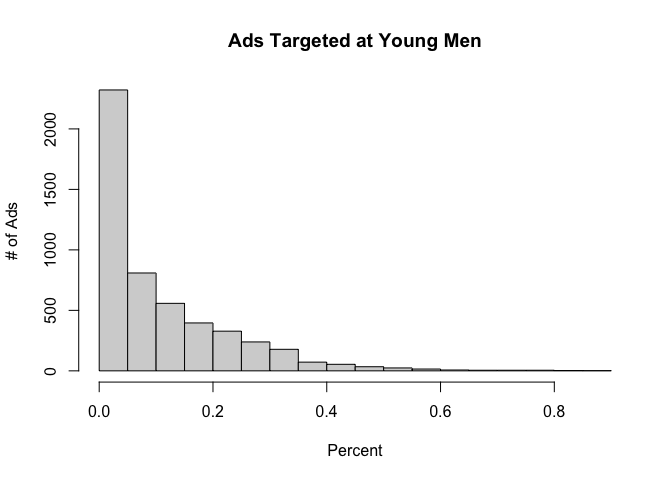
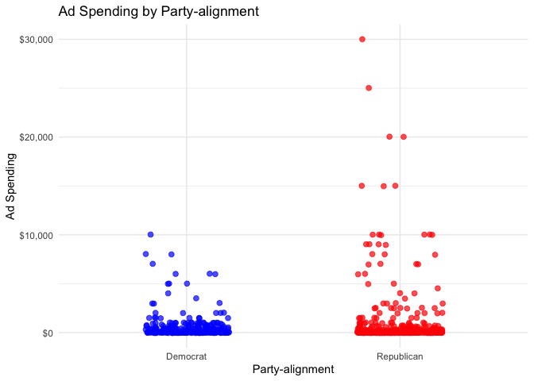
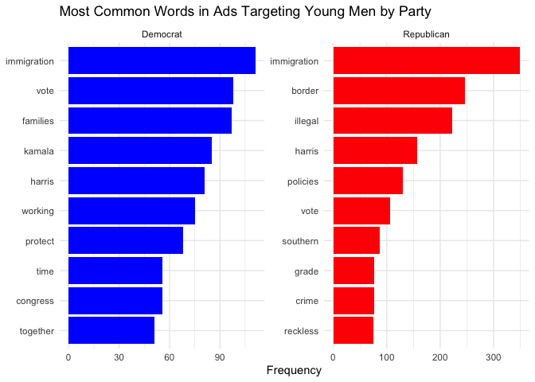
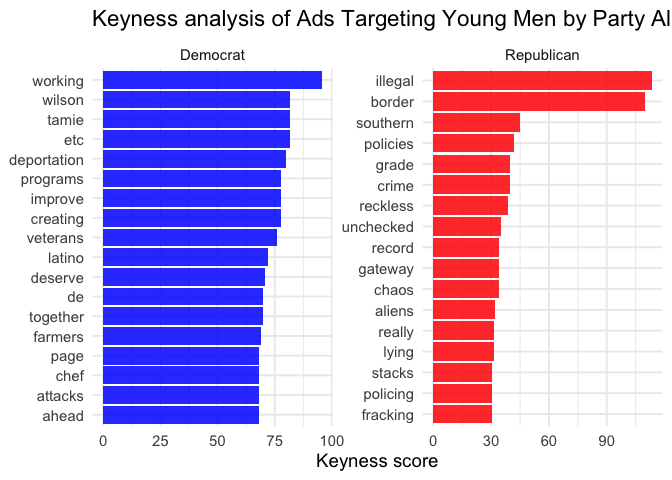
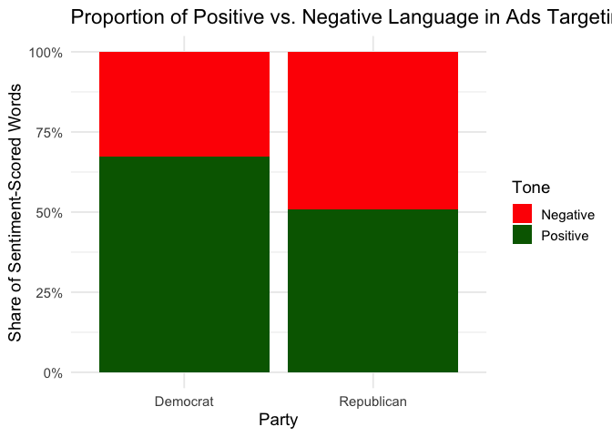

Josh Cohn - Final Project Markdown
================
2025-12-17

### Downloaded CSV file data from meta, but ended up as a zip file so need to unzip it!

``` r
unzip("meta-ad-library-2025-12-03_2.zip")

library(tidyverse)
```

    ## ── Attaching core tidyverse packages ──────────────────────── tidyverse 2.0.0 ──
    ## ✔ dplyr     1.1.4     ✔ readr     2.1.5
    ## ✔ forcats   1.0.0     ✔ stringr   1.5.1
    ## ✔ ggplot2   3.5.1     ✔ tibble    3.2.1
    ## ✔ lubridate 1.9.4     ✔ tidyr     1.3.1
    ## ✔ purrr     1.0.4     
    ## ── Conflicts ────────────────────────────────────────── tidyverse_conflicts() ──
    ## ✖ dplyr::filter() masks stats::filter()
    ## ✖ dplyr::lag()    masks stats::lag()
    ## ℹ Use the conflicted package (<http://conflicted.r-lib.org/>) to force all conflicts to become errors

``` r
meta_ads <- read_csv("meta-ad-library-2025-12-03_2.csv")
```

    ## Rows: 5054 Columns: 19
    ## ── Column specification ────────────────────────────────────────────────────────
    ## Delimiter: ","
    ## chr  (14): page_name, byline, ad_creative_bodies, ad_creative_link_titles, a...
    ## dbl   (2): ad_archive_id, page_id
    ## date  (3): ad_creation_time, ad_delivery_start_time, ad_delivery_stop_time
    ## 
    ## ℹ Use `spec()` to retrieve the full column specification for this data.
    ## ℹ Specify the column types or set `show_col_types = FALSE` to quiet this message.

### Unnesting Demographic Data into its own columns so I can filter out young men (Men, 18-24 + 25-34)

``` r
# I had to google how to unnest this data, and after a significant amount of trial and error and trial and error etc etc, ended up getting the following code to work:


# Demographic data is in long json string form, so need to download jsonlite, and clean the strings to get what we want! (men 18-34)

library(jsonlite)
```

    ## 
    ## Attaching package: 'jsonlite'

    ## The following object is masked from 'package:purrr':
    ## 
    ##     flatten

``` r
# Creating function to Clean JSON strings in Demographics column 
clean_json <- function(x) {
  if (is.na(x) || x == "" || x == "NA") return("[]") # Replacing empty strings with an empty JSON array
  
  if (!grepl("^[\\[{]", x)) return("[]")  # If doesn't start with { or [, it's invalid
  
  x  # otherwise keep it
}

# Cleaning demographic column with clean_json function 
meta_ads_clean <- meta_ads %>%
  mutate(
    demo_raw = map_chr(demographic_distribution, clean_json),
    demo_json = paste0("[", demo_raw, "]")
  )

# If any rows are empty, broken, or weird and R hits a broken one, this parsing function is supposed to make sure r doesn't stop running the function:
safe_parse <- function(x) {
  out <- tryCatch(fromJSON(x), error = function(e) NULL)
  
  if (is.null(out)) return(tibble(age = NA, gender = NA, percentage = NA))
  
  if (is.list(out) && is.null(names(out))) {
    return(tibble(age = NA, gender = NA, percentage = NA))
  }
  
  as_tibble(out)
}

meta_ads_parsed <- meta_ads_clean %>%
  mutate(demo_list = map(demo_json, safe_parse))

ads_with_demographics <- meta_ads_parsed %>%
  unnest(demo_list) %>%
  rename(pct = percentage)
```

### Now that data is unnested, I am able to filter out young men

``` r
# Now, only using rows for Men 18-24 + 25+34

ads_young_men <- ads_with_demographics %>%
  filter(
    gender == "male",
    age %in% c("18-24", "25-34")
  )

# Combining 18-24 and 25-34 into one row per ad, aggregating the %

young_men_pct <- ads_with_demographics %>%
  mutate(is_young_male = gender == "male" & age %in% c("18-24","25-34")) %>%
  group_by(ad_archive_id) %>%
  summarise(
    pct_young_male = sum(pct[is_young_male], na.rm = TRUE),
    .groups = "drop"
  )

# Trial and error, figuring out which % cutoff point to use:

hist(
  young_men_pct$pct_young_male,
  main = "Ads Targeted at Young Men",
  xlab = "Percent",
  ylab = "# of Ads"
)
```

<!-- -->

``` r
#Somewhere between 0.1 -> 0.4 seems like a good cutoff
# A massive chunk of ads target ~0-10% of this group, so anything higher could be categorized as targeting more young men 
# I want enough data for findings to be meaningful, but want it to be ads focused on that young male group...

young_men_ads <- young_men_pct %>%
  filter(pct_young_male >= 0.20)

# Using an inner join to rejoin this with the rest of the data, but only keeping ads targeting young men

final_young_men_ads <- meta_ads %>%
  inner_join(young_men_ads, by = "ad_archive_id")
```

### Exporting final_young_men_ads so I can dig into the advertisers manually to determine which are clearly republican/democratically aligned

``` r
# using writexl function to export the data into excel
library(writexl)

write_xlsx(final_young_men_ads, "final_young_men_ads.xlsx")

# From here, I dug through the spreadsheet manually, seperating out democratic advertisers from republican ones!
# I then put them in two seperate sheets, and redownloaded them as CSV files that I will now re-import into r

republican_ads <- read_csv("republican_advertisers.csv")
```

    ## Rows: 384 Columns: 23
    ## ── Column specification ────────────────────────────────────────────────────────
    ## Delimiter: ","
    ## chr  (14): page_name, byline, ad_creative_bodies, ad_creative_link_titles, a...
    ## dbl   (3): ad_archive_id, page_id, pct_young_male
    ## date  (6): ad_creation_time, ad_delivery_start_time, ad_delivery_stop_time, ...
    ## 
    ## ℹ Use `spec()` to retrieve the full column specification for this data.
    ## ℹ Specify the column types or set `show_col_types = FALSE` to quiet this message.

``` r
democratic_ads <- read_csv("democratic_advertisers.csv")
```

    ## Rows: 278 Columns: 23
    ## ── Column specification ────────────────────────────────────────────────────────
    ## Delimiter: ","
    ## chr  (14): page_name, byline, ad_creative_bodies, ad_creative_link_titles, a...
    ## dbl   (3): ad_archive_id, page_id, pct_young_male
    ## date  (6): ad_creation_time, ad_delivery_start_time, ad_delivery_stop_time, ...
    ## 
    ## ℹ Use `spec()` to retrieve the full column specification for this data.
    ## ℹ Specify the column types or set `show_col_types = FALSE` to quiet this message.

``` r
# Now adding party column for each dataset, and rejoining them back together so I can compare them!

republican_ads <- republican_ads |> mutate(party = "Republican")
democratic_ads <- democratic_ads |> mutate(party = "Democrat")

ads_by_party <- bind_rows(republican_ads, democratic_ads)
```

### I want to delve into impressions and spending data, but meta CSV provides them as ranges like: “lower_bound: 600, upper_bound: 699”

So I decided to convert them all to the lower bound value for
consistencies sake. This will ensure they’re numeric and measurable as
well. Using dplyr and stringr. Going to mutate the data and add columns
for lower bound of impressions and money

``` r
# Downloading dplyr and stringr to mutate in order to get just lower bound values
library(dplyr)
library(stringr)

clean_ranges <- function(x) {
  x |> 
    str_extract("lower_bound: ?\\d+") |> 
    str_extract("\\d+") |> 
    as.numeric()
}

ads_by_party_clean <- ads_by_party |> 
  mutate(
    spend_lower = clean_ranges(spend),
    impressions_lower = clean_ranges(impressions)
  )
```

### Now the data is fully cleaned and prepared for analysis! Starting by looking into spending data!

``` r
# Downloading ggplot for graphing
library(ggplot2)

# Plot ad spending by party alignment with jittered scatterplot
ggplot(ads_by_party_clean, aes(x = party, y = spend_lower, color = party, text = paste(byline, "<br>Money Spent: $", spend_lower))) +
  geom_jitter(width = 0.2, alpha = 0.7, size = 2) +
  scale_color_manual(values = c("Republican" = "red", "Democrat" = "blue")) +
  scale_y_continuous(labels = scales::dollar_format()) +
  labs(title = "Ad Spending by Party-alignment", x = "Party-alignment", y = "Ad Spending") +
  theme_minimal() +
  theme(legend.position = "none")
```

<!-- -->

``` r
# Simple table displaying total and average money spent on ads targeting men by party
spending_summary <- ads_by_party_clean %>%
  group_by(party) %>%
  summarise(
    total_spend = sum(spend_lower, na.rm = TRUE),
    average_spend = mean(spend_lower, na.rm = TRUE),
    ad_count = n(),
    .groups = "drop"
  )

spending_summary
```

    ## # A tibble: 2 × 4
    ##   party      total_spend average_spend ad_count
    ##   <chr>            <dbl>         <dbl>    <int>
    ## 1 Democrat        168300          605.      278
    ## 2 Republican      431900         1125.      384

### Total impressions by party

``` r
# Adding new young men impressions column
ads_by_party_clean <- ads_by_party_clean %>%
  mutate(
    young_men_impressions = impressions_lower * pct_young_male
  )

# Adding up collumns to get the total young men impressions by party
total_young_men_impressions <- ads_by_party_clean %>%
  group_by(party) %>%
  summarise(
    total_young_men_impressions = sum(young_men_impressions, na.rm = TRUE),
    .groups = "drop"
  )

total_young_men_impressions
```

    ## # A tibble: 2 × 2
    ##   party      total_young_men_impressions
    ##   <chr>                            <dbl>
    ## 1 Democrat                      5217241.
    ## 2 Republican                   12279474.

``` r
# Looking into Top advertisers by young men impressions. Who is driving these numbers?
top_young_men_pages <- ads_by_party_clean %>%
  group_by(party, page_name) %>%
  summarise(
    total_young_men_impressions = sum(young_men_impressions, na.rm = TRUE),
    .groups = "drop"
  ) %>%
  group_by(party) %>%
  slice_max(total_young_men_impressions, n = 5) %>%
  ungroup()

top_young_men_pages
```

    ## # A tibble: 10 × 3
    ##    party      page_name                    total_young_men_impressions
    ##    <chr>      <chr>                                              <dbl>
    ##  1 Democrat   The Daily Scroll                                1326581.
    ##  2 Democrat   NowThis Impact                                   841383.
    ##  3 Democrat   Kamala Harris                                    449926.
    ##  4 Democrat   WinSenate                                        436386.
    ##  5 Democrat   House Majority PAC                               403390.
    ##  6 Republican NumbersUSA                                      8597877.
    ##  7 Republican Citizens For Free Enterprise                     647405.
    ##  8 Republican Turning Point USA                                577989 
    ##  9 Republican Right For America PAC                            325284.
    ## 10 Republican Ben Shapiro                                      238929

### Now looking at common words using corpus code from our 12/2 class!

``` r
library(quanteda)
```

    ## Package version: 4.3.1
    ## Unicode version: 14.0
    ## ICU version: 71.1

    ## Parallel computing: disabled

    ## See https://quanteda.io for tutorials and examples.

``` r
# Creating ad corpus
ad_corpus <- corpus(ads_by_party_clean, text_field = "ad_creative_bodies")
```

    ## Warning: NA is replaced by empty string

``` r
# Defining custom custom stopwords (Many ended up being very common in political ad space, with substantive meaning on their own)
custom_stopwords <- c("us", "amp", "will", "can", "get", "see", "state", "district", "bring")

# Now tokenizing and cleaning the text, including removing custom and standard stopwords
ad_tokens <- tokens(ad_corpus,
                    remove_punct = TRUE,
                    remove_numbers = TRUE) %>%
  tokens_tolower() %>%
  tokens_remove(stopwords("en")) %>%         
  tokens_remove(custom_stopwords) %>%       
  tokens_select(pattern = "^[a-z]+$", valuetype = "regex")

# Creating a dfm 
ad_dfm <- dfm(ad_tokens)

# Adding party info so I can seperate out by party alignment
docvars(ad_dfm, "party") <- ads_by_party_clean$party

# Convert the dfm to long format for easier analysis
dfm_long <- convert(ad_dfm, to = "data.frame") %>%
  select(-doc_id) %>%
  mutate(party = ads_by_party_clean$party) %>%
  pivot_longer(-party, names_to = "word", values_to = "count") %>%
  group_by(party, word) %>%
  summarise(freq = sum(count), .groups = "drop") %>%
  arrange(party, desc(freq))

# Filtering for the top 10 words per party
top_words_by_party <- dfm_long %>%
  group_by(party) %>%
  slice_max(freq, n = 10) %>%
  ungroup()

top_words_by_party
```

    ## # A tibble: 20 × 3
    ##    party      word         freq
    ##    <chr>      <chr>       <dbl>
    ##  1 Democrat   immigration   111
    ##  2 Democrat   vote           98
    ##  3 Democrat   families       97
    ##  4 Democrat   kamala         85
    ##  5 Democrat   harris         81
    ##  6 Democrat   working        75
    ##  7 Democrat   protect        68
    ##  8 Democrat   congress       56
    ##  9 Democrat   time           56
    ## 10 Democrat   together       51
    ## 11 Republican immigration   349
    ## 12 Republican border        247
    ## 13 Republican illegal       222
    ## 14 Republican harris        157
    ## 15 Republican policies      130
    ## 16 Republican vote          107
    ## 17 Republican southern       87
    ## 18 Republican crime          77
    ## 19 Republican grade          77
    ## 20 Republican reckless       75

``` r
# Plot the top words, need to download tidytext
library(tidytext)

# Based on feedback from presentation will reorder words as well 
top_words_by_party %>%
  ggplot(aes(
    x = reorder_within(word, freq, party),
    y = freq,
    fill = party
  )) +
  geom_col(show.legend = FALSE) +
  facet_wrap(~party, scales = "free") +
  coord_flip() +
  scale_x_reordered() +
  scale_fill_manual(
    values = c(
      "Democrat" = "blue",
      "Republican" = "red"
    )
  ) +
  labs(
    title = "Most Common Words in Ads Targeting Young Men by Party",
    x = NULL,
    y = "Frequency"
  ) +
  theme_minimal()
```

<!-- -->

### Keyness analysis (as suggested in presentation feedback)

``` r
# Needed to load the quanteda.textstats package to get this to work
library(quanteda.textstats)

# Creating another dfm for the keyness analysis
dfm_ads <- dfm(ad_tokens)

# Add party alignment 
docvars(dfm_ads, "party") <- ads_by_party_clean$party

#  Aggregate documents by each party alignment
dfm_party <- dfm_group(
  dfm_ads,
  groups = docvars(dfm_ads, "party")
)

#  Now running textstat_keyness to get keyness score for each group of dem/rep aligning ads
# Sets republican as reference group here also
keyness_results <- textstat_keyness(
  dfm_party,
  target = "Republican"
)

# Assigning words to the party they are most disproportianately associated with
keyness_labeled <- keyness_results %>%
  mutate(
    party = if_else(chi2 > 0, "Republican", "Democrat"),
    chi2_abs = abs(chi2)
  )

# Finding the top 15 distinctive words for each party
top_keyness_by_party <- keyness_labeled %>%
  group_by(party) %>%
  slice_max(chi2_abs, n = 15) %>%
  ungroup()

# Plotting keyness by party alignment
#For consistency I want to plot both parties on one graph, like I did for top words
ggplot(
  top_keyness_by_party,
  aes(
    x = reorder_within(feature, chi2_abs, party),
    y = chi2_abs,
    fill = party
  )
) +
  geom_col(show.legend = FALSE, alpha = 0.85) +
  facet_wrap(~party, scales = "free") +
  coord_flip() +
  scale_x_reordered() +
  scale_fill_manual(
    values = c(
      "Democrat" = "blue",
      "Republican" = "red"
    )
  ) +
  labs(
    title = "Keyness analysis of Ads Targeting Young Men by Party Alignment",
    x = NULL,
    y = "Keyness score"
  ) +
  theme_minimal(base_size = 14)
```

<!-- -->

### Sentiment Analysis using AFINN (Scaled as Proportions)

``` r
# First, tokenizing ad text into individual words
ads_words <- ads_by_party_clean %>%
  select(party, ad_creative_bodies) %>%
  filter(!is.na(ad_creative_bodies)) %>%
  unnest_tokens(word, ad_creative_bodies)

# Using AFINN sentiment (sentiment scores from -5 to +5)
afinn <- get_sentiments("afinn")

#I only want to keep words that are in the AFINN system and get scored
ads_sentiment <- ads_words %>%
  inner_join(afinn, by = "word")   

# Grouping sentiment into Positive / Negative / Neutral scores, respectively
ads_sentiment <- ads_sentiment %>%
  mutate(
    tone = case_when(
      value > 0 ~ "Positive",
      value < 0 ~ "Negative",
      TRUE ~ "Neutral"
    )
  )

# Sum the total # of words in each sentiment category by party and also compute proportions
tone_props <- ads_sentiment %>%
  group_by(party, tone) %>%
  summarise(n = n(), .groups = "drop") %>%
  group_by(party) %>%
  mutate(prop = n / sum(n)) %>%
  ungroup()

tone_props
```

    ## # A tibble: 4 × 4
    ##   party      tone         n  prop
    ##   <chr>      <chr>    <int> <dbl>
    ## 1 Democrat   Negative   235 0.327
    ## 2 Democrat   Positive   484 0.673
    ## 3 Republican Negative   968 0.493
    ## 4 Republican Positive   997 0.507

``` r
# Now plotting proportion of positive vs negative sentiment by party
# -----------------------------
ggplot(tone_props, aes(x = party, y = prop, fill = tone)) +
  geom_col() +
  scale_y_continuous(labels = scales::percent_format()) +
  scale_fill_manual(
    values = c(
      "Positive" = "darkgreen",
      "Negative" = "red",
      "Neutral" = "gray"
    )
  ) +
  labs(
    title = "Proportion of Positive vs. Negative Language in Ads Targeting Young Men",
    x = "Party",
    y = "Share of Sentiment-Scored Words",
    fill = "Tone"
  ) +
  theme_minimal(base_size = 14)
```

<!-- -->
